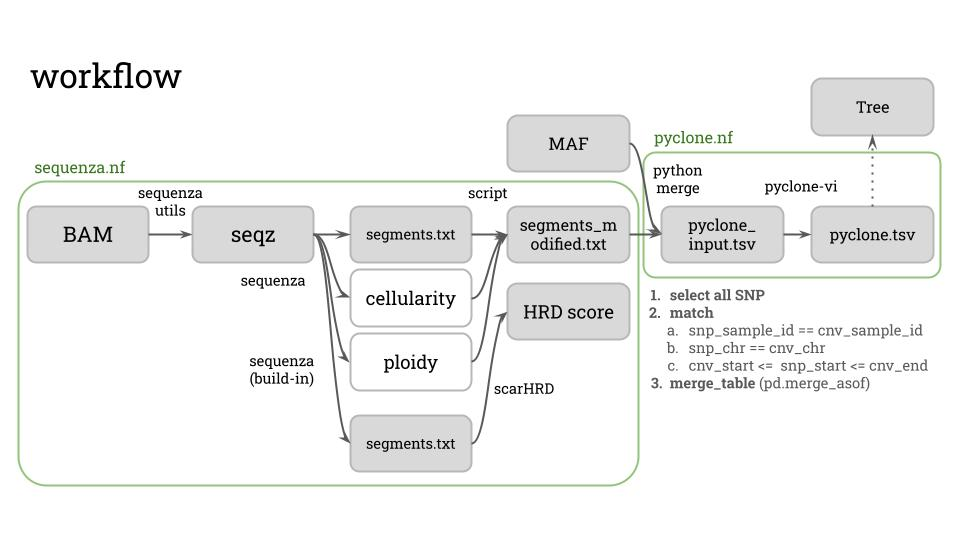

# sequenza_scarHRD_pyclone Nextflow Pipeline

## 專案簡介
  
本專案包含一系列基於 Nextflow 的工作流程，用於處理基因組數據分析，包括 Sequenza 和 PyClone-VI 的分析流程。  
主要流程為利用Sequenza估計cellularity以及CNV，再結合somatic SNV，並使用PyClone-VI分析癌症基因組數據。

---

## 目錄結構

```
sequenza_scarHRD_pyclone_pipeline/
├── nextflow.config        # Nextflow 配置檔案
├── pyclone.nf             # PyClone-VI 分析流程
├── sequenza.nf            # Sequenza 分析流程
├── envs/                  # Conda 環境配置檔案
│   ├── seqz.yaml          # Sequenza-utils 環境
│   ├── pyclone-vi.yaml    # PyClone-VI 環境
│   ├── r-sequenza.yaml    # R Sequenza 環境
│   └── scarHRD.yaml       # scarHRD 環境
├── bin/                   # 自定義腳本
│   ├── run_scarHRD.R      # scarHRD 分析腳本
│   └── run_sequenza.R     # Sequenza 分析腳本
├── tn_pairs.tsv           # 腫瘤-正常樣本對應表
├── output/                # 分析結果輸出目錄
├── work/                  # Nextflow 暫存目錄
└── README.md              # 專案說明文件
```

---

## 安裝與配置

### 1. 安裝 Nextflow
請參考 [Nextflow 官方文檔](https://www.nextflow.io/docs/latest/getstarted.html) 安裝 Nextflow。

### 2. 安裝 Conda 環境
使用以下指令安裝所需的 Conda 環境：

```bash
# https://sequenza-utils.readthedocs.io/en/latest/
conda env create -f envs/seqz.yaml
# https://bitbucket.org/sequenzatools/sequenza/src/chemins/
conda env create -f envs/r-sequenza.yaml
conda env create -f envs/pyclone-vi.yaml
conda env create -f envs/scarHRD.yaml
```

```R
# scarHRD install
# https://github.com/sztup/scarHRD
library(devtools)
install_bitbucket('sequenza_tools/sequenza')
install_github('aroneklund/copynumber')
```
---

## 使用方法

### 1. 執行 Sequenza 分析

```bash
nextflow run sequenza.nf \
  -c nextflow.config \
  -with-conda \
  -resume
```

### 2. 執行 PyClone-VI 分析

```bash
nextflow run pyclone.nf \
  -c nextflow.config \
  -with-conda \
  -resume
```

---

## 輸入文件

### 1. `tn_pairs.tsv`
- 定義腫瘤與正常樣本的 BAM 文件對應關係。
- 格式：

```
sample_id\ttumor_bam\tnormal_bam
LUAD_039_T\t/path/to/tumor.bam\t/path/to/normal.bam
```

### 2. `data/*.tsv`
- PyClone-VI 的輸入文件，包含各個Case的somatic SNV結合對應區段的CNV資訊。
1. mutation_id - Unique identifier for the mutation.
This is free form but should match across all samples.
> [!WARNING]
> PyClone-VI will remove any mutations without entries for all detected samples.
> If you have mutations with no data in a subset of the samples, the correct procedure is to extract ref and alt counts for these mutations from each affected sample's associated BAM file.
> Please refer to [this thread](https://groups.google.com/g/pyclone-user-group/c/wgXV7tq470Y) for further detail.

2. sample_id - Unique identifier for the sample.

3. ref_counts - Number of reads matching the reference allele.

4. alt_counts - Number of reads matching the alternate allele.

5. major_cn - Major copy number of segment overlapping mutation.

6. minor_cn - Minor copy number of segment overlapping mutation.

7. normal_cn - Total copy number of segment in healthy tissue.
For autosome this will be two and male sex chromosomes one.

You can include the following optional columns.

1. tumour_content - The tumour content (cellularity) of the sample.
Default value is 1.0 if column is not present.
> Note: In principle this could be different for each mutations/sample.
However it most cases it should be the same for all mutations in a sample.

2. error_rate - Sequencing error rate.
Default value is 0.001 if column is not present.
> Note: Most users will not need to change this value.
---

## 輸出文件

### Sequenza
- `output/<sample_id>/`: 包含 Sequenza 分析的結果。

### PyClone-VI
- `pyclone_output/<sample_id>/`: 包含 PyClone-VI 分析的結果。

---

